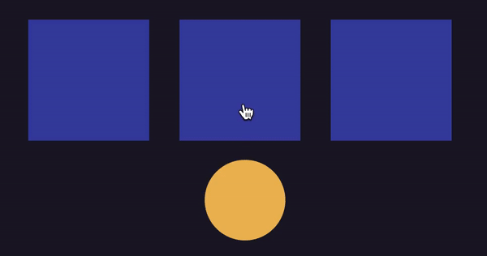

# Shell Game Assignment ✨
In this repository, you will find my solution to the test of developing a **shell game**.

## Preview Game Play

## Table of contents
- [Shell Game Assignment](#shell-game-assignment)
- [Preview Game Play](#preview-game-play)
- [Table of contents](#table-of-contents)
- [Installation](#installation)
- [Project Description](#project-description)
- [Improvement Points](#improvement-points)

## Installation
This project was generated with [Angular CLI](https://github.com/angular/angular-cli) version 12.2.4.

Clone this project locally and run 🏃🏽‍♀️:
- `ng serve --open` to navigate to `http://localhost:4200/`

I also have it deployed to GitHub Pages 👩🏽‍💻 --> https://adjoawadee.github.io/adjoawadee.github.io/

## Project Description 
This application is set up with Angular 12 and CSS 3 animations.
Currently, this application doesn't have a full test coverage due to insufficent time(see improvement points)

Once the application is up and running, there are some simple instructions avaliable for the player.

You can drag a shell (blue box) 🟦  to the yellow ball 🟡.

Press 'Play!' and the dragged boxed moves back up to the other boxes for a shuffel.
After the shuffel, its your turn to guess which shell contains the ball. 
If you choose the wrong box, it will shake!

## Improvement Points
While this was a nice challenge to get back to basics, there are a few points I would presonally like to improve.

It's also worth nothing that I had no clue what the shell game is so with the help of the internet, I came across this [**video**](https://www.youtube.com/watch?v=GumWeVdcof4) that was my guide 😁
- Better unit tests: Not all functions were covered.
- Responsiveness: At the moment, this cute game is only visually pleasing from 916px*859px 🙈 this is definately something worth improving. 
- Shuffel: shuffeling isn't entirely random but the ball is placed randomly. From what I understood from the video, there is a trick magicians use to trick people into thinking the ball is under the shell their eyes followed. I'm not sure if I did justice to that 🤫
- Resetting game: As much as I hate to mention this, I have to. At the moment, you can only reset this game by refreshing your browser. I really have to apoligize for that 🤦🏽‍♀️ But I promise you I can fix that. 
- Keeping score: keeping score of the number of times a player guessed right 👾

